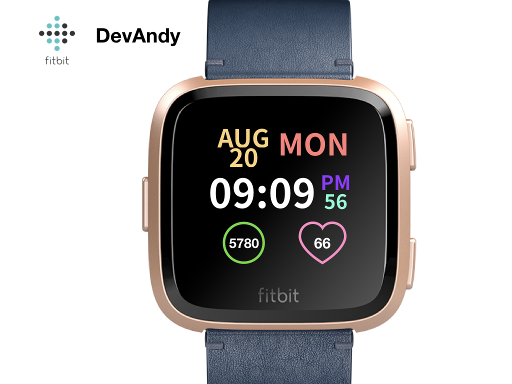
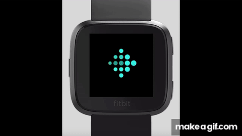

#Build a Fitbit Clock Face

## 목표

필요한 최소한의 데이터를 출력하는 간단한 클락 페이스를 만들어보자.

필요한 출력 데이터 : 날짜, 요일, 시:분:초, 걸음수(`steps`), 심박수(`hr`)

## 이슈

- 목표 수 대비 얼마나 걸었는지를 Circle로 표시해주는 `sweepAngle`이 작동되지 않고 있다. 계속 찾아보는중..

## 결과물

