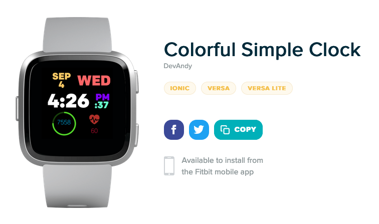

# Fitbit Clock Face

## 기획


필요한 최소한의 데이터를 출력하는 간단한 클락 페이스를 만들어보자.

필요한 출력 데이터

- 날짜
- 요일
- 시간 : `hours`, `minutes`, `seconds`
- Activity API
  - 걸음수(`steps`)
  - 심박수(`hr`)

<br>

## 개발환경

- VSCode - 아직 익숙치 않아서 Sublime Text와 병행해서 사용..
- <a href="https://dev.fitbit.com/blog/2018-03-13-announcing-fitbit-os-2.0-and-simulator/#the-device-simulator-" target="_blank">Fitbit Simulator</a> - 만들고 있는 앱을 테스트할 수 있는 시뮬레이터.
- Terminal

<br>

## 이슈

- [x] <strike>목표 수 대비 얼마나 걸었는지를 Circle로 표시해주는 `sweepAngle`이 작동되지 않고 있다. 계속 찾아보는중..</strike>
  
  - `.gui` 에서는 `sweep-angle` 로 작성하고, `.js` 에서는 `sweepAngle` 로 작성해야만 작동.
  
- [x] <strike>첫 날 테스트한 결과 배터리 소모가 심하다는 느낌을 받음. 완충하고 수면 이후 확인해보니 78%까지 배터리 소모. (평소는 95% 이상 유지)</strike>
  
  - Simulator로 테스트하기 위해 작성한 `setInterval` 을 제거하지 않아서 발생한 배터리 소모로 확인. 제거하니 배터리 효율이 향상.
  
- [x] <strike>평상시엔 괜찮다가 걷는도중엔 `steps`의 completion을 보여주는 circle이 깜빡거리면서 비중이 왔다갔다 하는 <a href="https://photos.app.goo.gl/CE9Ykvodc4uyW5YB7" target="_blank">에러</a> 발생중.</strike>
  
  - 위와 마찬가지. `setInterval` 함수를 삭제하고 나니 걸으면서 보더라도 버그가 발생하지 않았다.
  
- [x] <strike>`hours` 가 두자릿수가 아니면 앞에 0이 붙도록 코드를 첨부하였으나 작동하지 않는중.</strike>

  - 시간을 출력하는 코드에 조건문을 삽입하여 `hours`가 10미만일때 0이 붙도록 코드를 수정

  - ```javascript
    if(hours<10){
        myClock.text = `0${hours}:${minutes}`;
    } else {
        myClock.text = `${hours}:${minutes}`;
    }
    myClock_seconds.text = `:${seconds}`;
    ```

<br>

## 결과물


아래 링크를 통해 바로 설치가능하다.

https://gallery.fitbit.com/details/e44ef4c9-d300-4ec2-93e6-8cbc589c986d



<br>

